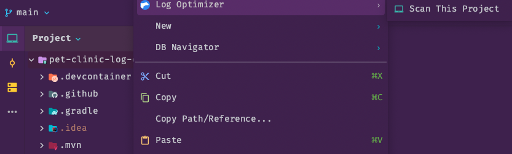
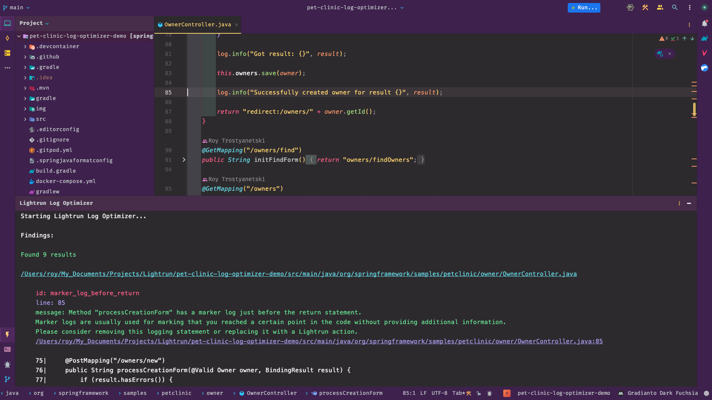

# Log Optimizer Sample Application 

This is  a sample demo app that is based on the repo  
https://github.com/spring-projects/spring-petclinic  
with some bad logs we put inside  
Use the Lightrun Log Optimizer to scan the project and find those logs

 

